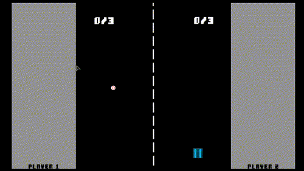

# Draw Ping Pong

Draw your paddle to deflect the puck into your opponent's fence! Play this minimal game with a friend while in the car, at the doctor's office, or waiting for other stuff while bored!

Based upon the ["Pong" Godot engine demo](https://github.com/godotengine/godot-demo-projects/tree/3.4-585455e/2d/pong) and the source code found [here](https://github.com/k0il/DrawingLine).

Guy who wrote it: Jason Anderson.

Sources of assets:

* ["Simple pixel art UI pack"](https://kobliznik.itch.io/pixel-ui-pack) copyright (c) 2020 kobliznik.
* ["Sharp Retro"](https://opengameart.org/content/sharp-retro-font) font Copyright (c) 2015 JROB774, CC-BY 3.0 license.
* ["round_end.wav"](https://opengameart.org/content/oldschool-win-and-die-jump-and-run-sounds) copyright (c) 2011 sauer2, CC0 license.
* [8-bit Ping Pong](https://opengameart.org/content/3-ping-pong-sounds-8-bit-style) sounds copyright (c) 2012 captaincrunch80, CC0 license.